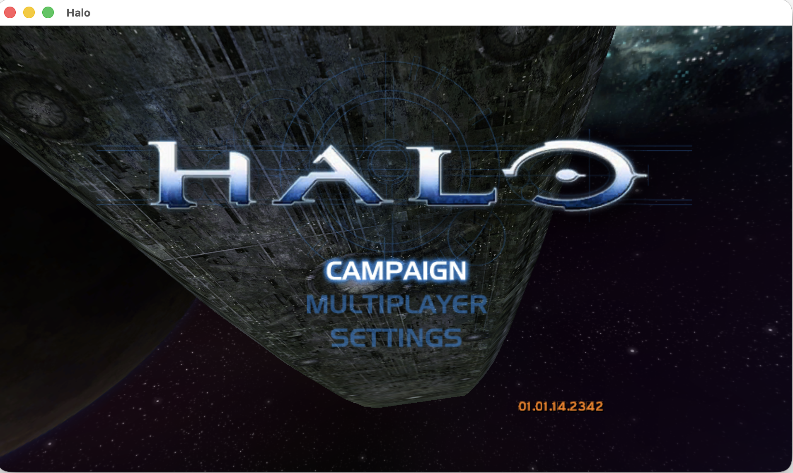

<h1 align="center">Halo CE · Apple Silicon</h1>
<p align="center">
  
  
  
</p>
<p align="center"></p>

```bash
curl -fsSL https://raw.githubusercontent.com/pkyanam/halo-ce-apple-silicon/main/setup.sh | bash -s -- "/path/to/your/Halo Xbox.iso"
```

| Your disc image | Compatibility |
|---|---|
| Xbox XISO / decrypted Redump XDVDFS | Complete retail Xbox v5 caches: `01.10.12.2276` (NTSC) or `01.01.14.2342` (PAL); 24 maps + 5 movies required |
| USA Rev1 XISO | Genuine headers/tree/extents match hashed assets; gameplay tested |
| Other Xbox regions/revisions | Accepted when cache/data checks pass; not independently gameplay-verified. PAL normalization exists; genuine Redump gameplay untested |
| PC/Mac installer, Custom Edition, MCC, encrypted images/archives | Unsupported formats rejected |

Build Halo: Combat Evolved for Apple Silicon from your own Xbox disc image. Setup fetches pinned public sources, compiles a native ARM64 engine, bundles game data and libraries, and creates an ad-hoc signed Finder app. It never downloads Halo or launches the game during installation.

Install Apple Command Line Tools (`xcode-select --install`) and [Homebrew](https://brew.sh) first. Setup installs Python, CMake, pkgconf, SDL3, FFmpeg, LLVM and LLD. Allow space for the ISO, temporary extraction, bundled game data and build tools. Python is a build dependency; the finished app has a native launcher.

The result is `~/Applications/Halo Combat Evolved.app`. All required maps, movies and libraries live inside the app. Move it freely: the ISO, extraction workspace and external asset folders are unnecessary afterward. Original images and existing saves/preferences are preserved; verified extraction staging is removed. An existing output stops installation; set `HALO_APP_OUTPUT` to retain another app.

| macOS requirement | Evidence |
|---|---|
| Native deployment/API floor | Explicit macOS 14 target |
| Packaged minimum | Highest ARM64 requirement of engine and bundled libraries |
| Current local dependencies | macOS 26 minimum; gameplay tested on 26 |
| macOS 15 CI | Fresh build workflow provided; check its actual result |

F10 cycles 4:3 (640×480), 720p and 1080p, saving the choice; F11 toggles fullscreen; F12 releases mouse capture; Cmd-Q quits. Use Fn with function keys if your keyboard assigns media controls. Writable configuration, saves, logs and caches live in `~/Library/Application Support/Halo Native AOT`. Edit `save/config.toml` while closed. Existing preferences are retained. A fresh starter bounds internal rendering; the native launcher activates an existing instance when opened twice.

| Device | Coverage |
|---|---|
| Keyboard/mouse | Opening campaign movement, interaction, relative look and quit tested |
| Xbox / PlayStation / DualSense | SDL3 mappings and virtual Xbox/DualSense fixtures; physical Bluetooth/USB, device-specific behavior and advanced haptics unverified |

Lighter opening scenes measured about 60 FPS; tutorials/transitions run slower and intro pacing can jitter. Two local engine instances joined and replicated manual movement with clean exits. Full campaign completion and cross-platform LAN remain unverified. Per-map runtime coverage is still being validated; consult the [map validation matrix](docs/MAP_TEST_MATRIX.md). See [runtime coverage](docs/RUNTIME_VALIDATION.md). This is an experimental port. [HD texture research/tooling](docs/HD_TEXTURES.md) stays separate from the default build; no pack is installed.

To inspect tooling before running:

```bash
git clone https://github.com/pkyanam/halo-ce-apple-silicon.git
cd halo-ce-apple-silicon
./setup.sh "/path/to/your/Halo Xbox.iso" --jobs 4
```

`HALO_WORK_DIR` selects a fresh workspace outside this repository. `pins.json` fixes source/runtime commits and musl's SHA-256. Synthetic reader/manifest fixtures run with `python3 -m unittest discover -s tests`; native build fixtures exercise UI conditions and translated controller adapters. Asset, engine and ELF hashes, dependency deployment versions and signatures are checked before staging cleanup. Static checks establish package integrity; gameplay coverage is listed separately. See [build/reproduction instructions](docs/BUILD.md).

The port builds on [cybersecurity/halo-ce-universal](https://github.com/cybersecurity/halo-ce-universal) and its documented [bnunu/halo-1](https://github.com/bnunu/halo-1) lineage. [Source references](docs/UPSTREAM.md) explain the retained protocol/cache baseline. Original tooling is MIT; third-party licenses remain separate in [NOTICE.md](NOTICE.md). Halo and related artwork belong to their owners. This unofficial fan project is not endorsed by Microsoft, Bungie or Xbox.
